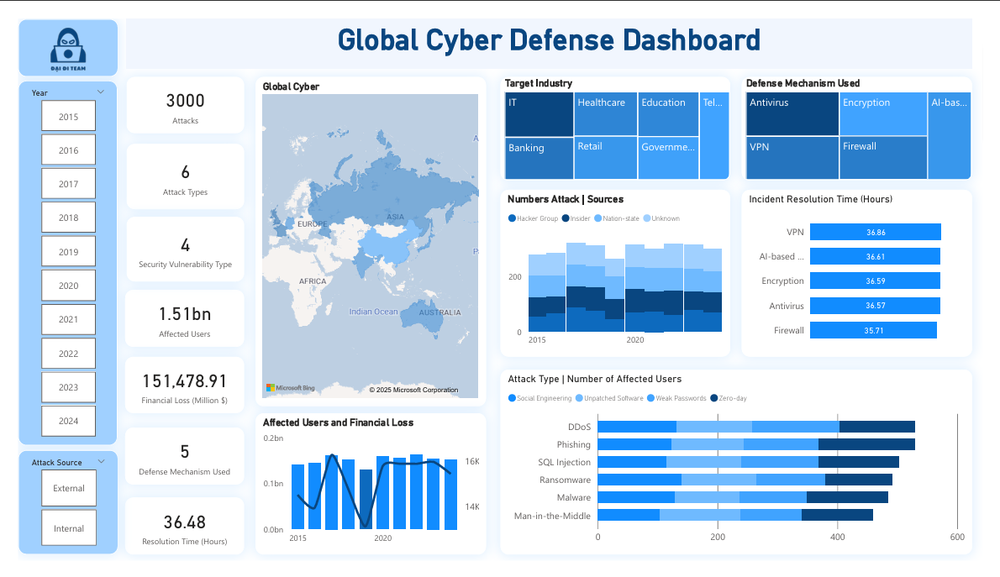

# Phân Tích Các Mối Đe Dọa An Ninh Mạng Toàn Cầu

Dự án này tập trung phân tích các xu hướng và mô hình của **các mối đe dọa an ninh mạng trên toàn cầu**, sử dụng dữ liệu thực tế. Quá trình phân tích bao gồm làm sạch dữ liệu, trực quan hóa và trình bày báo cáo dưới dạng dashboard.

## Mô tả

| Tên tệp | Mô tả |
|--------|-------|
|`Global Cyber Threats_Data.xlsx` | Dữ liệu thô về các mối đe dọa an ninh mạng toàn cầu   Nguồn: [🌐 Global Cybersecurity Threats (2015-2024)](https://www.kaggle.com/datasets/atharvasoundankar/global-cybersecurity-threats-2015-2024)
| `Globaly Cyber_TienXuly.ipynb` | Notebook Python để xử lý dữ liệu (dùng Pandas, Matplotlib) |
| `GlobalCyber_Visualization.pbix` | Dashboard xây dựng bằng Power BI |
| `GlobalCyber_AnalyticalApproach.txt` | Hướng khai thác insights từ bộ dữ liệu |

## Dashboard

> 

## Công Cụ Sử Dụng

- **Power BI**: trực quan hóa dữ liệu
- **Python (Jupyter Notebook)**: xử lý và làm sạch dữ liệu
- **Excel**: lưu trữ dữ liệu tải về ban đầu

## 👤 Giới Thiệu Cá Nhân

Dự án được thực hiện bởi *Trần Thị Minh Ngọc* – sinh viên định hướng theo lĩnh vực Phân tích Dữ liệu và Business Intelligence.  
Mong muốn phát triển trong các vai trò liên quan đến phân tích dữ liệu, xây dựng dashboard, và hỗ trợ ra quyết định kinh doanh dựa trên dữ liệu.

📬 Email: [minhngoc04.work@gmai@.com]
